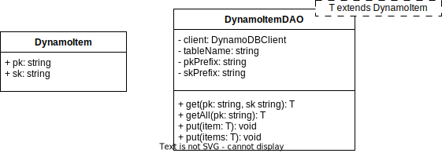

# stepinto-aws-tools

This packages includes a number of resources which are useful for developing and deploying
applications using Amazon Web Services resources and infrastructure.  It is intended for use
with applications under the Stepinto.io umbrella, and follows patterns and conventions developed
by Adam Fitzpatrick.

Specifically, the package hosts a selection of simplified clients for accessing certain AWS
resources, L3 AWS CDK constructs, and utilities for consistent tagging and naming of AWS resources.

## AWS API Clients

### DynamoDB Data Access Object

This DAO provides access to items contained in one table which follows the single-table design
pattern.

Given a DynamoDB table with partition key field named "pk" and sort key field name "sk", and key
fields namespaced with delimiter "#", a base DynamoItem class can be extended, and provided as
a parameter to the DynamoDB client to store and retrieve items from the table. Input command
elements such as `KeyConditionExpression` are abstracted away, and the DAO will make follow-up
requests to obtain additional data based on `LastEvaluatedKey` in responses. Items are
automatically marshalled and unmarshalled for DynamoDB.

<center>



</center>

#### Example

Consider `ExampleItem extends DynamoItem`, stored in DynamoDB table 'ExampleTable':

```typescript
{
    pk: 'ex#item-1',
    sk: 'date#12-30-2024',
    strData: 'some string value'
}
```

DAO is instantiated as follows:

```typescript
const dao = new DynamoItemDAO<ExampleItem>('ExampleTable', { pkPrefix: 'ex', skPrefix: 'date' })
```

The following methods are available on the DAO:

| <div style="width: 400px">Method</div> | Description |
| --- | --- |
| `get(pk: string, sk: string): ExampleItem` | Uses [GetItemCommand](https://docs.aws.amazon.com/AWSJavaScriptSDK/v3/latest/client/dynamodb/command/GetItemCommand/) to retrieve a single item matching the provided pk (partition key) and sk (sort key), automatically prefixing the keys as required for single-table design |
| `getAll(pk: string): ExampleItem[]` | Uses [QueryCommand](https://docs.aws.amazon.com/AWSJavaScriptSDK/v3/latest/client/dynamodb/command/QueryCommand/) to retrieve all items associated with the provided partition key, and with a sort key that begins with 'sort#' |
| `put(item: ExampleItem): void` | Uses the [PutItemCommand](https://docs.aws.amazon.com/AWSJavaScriptSDK/v3/latest/client/dynamodb/command/PutItemCommand/) to upsert an item into the table |
| `put(items: ExampleItem[]): void` | Overloaded method to upsert multiple items into the table using [BatchWriteItemCommand](https://docs.aws.amazon.com/AWSJavaScriptSDK/v3/latest/client/dynamodb/command/BatchWriteItemCommand/) |

Note that each DAO is specific to both table and key prefixes; as a result, each of the following calls will throw errors:

```typescript
dao.get('other#item-1', 'date#12-30-24')    // Partition key prefix is incorrect
```

```typescript
dao.get('ex#item-1', 'wrong#12-30-24')      // Sort key prefix is incorrect
```

```typescript
dao.getAll('other#item-1')                  // Partition key prefix is incorrect
```

```typescript
dao.put({
    pk: 'other#item-1',
    sk: 'wrong#12-30-24'
    strDate: 'some string value'
})                                          // Both partition and sort key prefixes are incorrect
```
